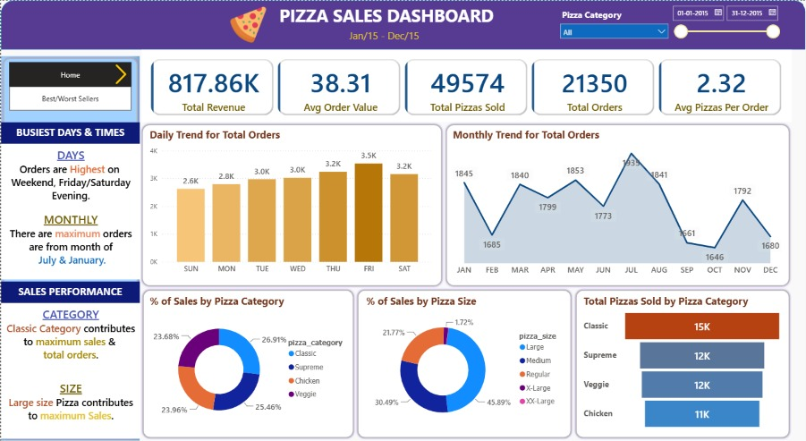

# 🍕 Pizza Sales Dashboard | Power BI + SQL



An end-to-end **Sales Analytics Project** built using **MySQL** and **Power BI** to analyze pizza sales performance throughout 2015.

This project leverages SQL for KPI calculations and business analysis, while Power BI is used to create an interactive dashboard for data visualization and decision-making.

---

## 📊 Dashboard Preview

### Home Dashboard


### Best & Worst Sellers Dashboard


---

## 🎯 Project Objectives

* Analyze overall sales performance.
* Identify best-selling and worst-selling pizzas.
* Discover ordering trends by day and month.
* Evaluate sales contribution by pizza category and size.
* Build an interactive dashboard for business decision-making.

---

## 📁 Dataset

**File:** `pizza_sales.csv`

**Period Covered:**
📅 01-Jan-2015 to 31-Dec-2015

### Dataset Features

* Order ID
* Order Date
* Order Time
* Pizza Name
* Pizza Category
* Pizza Size
* Quantity
* Unit Price
* Total Price

---

## 🔄 Project Workflow

1. Data Collection (`pizza_sales.csv`)
2. Data Cleaning using Power Query
3. KPI Calculation using SQL
4. Data Modeling in Power BI
5. DAX Measure Creation
6. Dashboard Development
7. Business Insight Generation

---

## 📈 Key Performance Indicators (KPIs)

| KPI                      |   Value |
| ------------------------ | ------: |
| Total Revenue            | 817.86K |
| Average Order Value      |   38.31 |
| Total Pizzas Sold        |  49,574 |
| Total Orders             |  21,350 |
| Average Pizzas per Order |    2.32 |

---

## 📋 Dashboard Pages

### 🏠 Home Dashboard

Provides a high-level overview of business performance through:

* Revenue KPIs
* Total Orders Analysis
* Daily Order Trends
* Monthly Order Trends
* Sales by Pizza Category
* Sales by Pizza Size
* Total Pizzas Sold by Category

### 📌 Best & Worst Sellers Dashboard

Highlights product performance through:

#### Top Performers

* Top 5 Pizzas by Revenue
* Top 5 Pizzas by Quantity Sold
* Top 5 Pizzas by Total Orders

#### Bottom Performers

* Bottom 5 Pizzas by Revenue
* Bottom 5 Pizzas by Quantity Sold
* Bottom 5 Pizzas by Total Orders

---

## 🔍 Business Insights

### Sales Trends

* Identified busiest days based on total orders.
* Analyzed monthly sales patterns.
* Discovered peak business periods throughout the year.

### Category Analysis

* Sales contribution by pizza category.
* Sales contribution by pizza size.
* Category-wise pizza sales performance.

### Product Performance

* Best-selling pizzas based on revenue.
* Most frequently ordered pizzas.
* Lowest-performing pizzas requiring business attention.

---

## 🗄 SQL Analysis

All SQL queries used for KPI calculations and business analysis are included in:

📄 `Pizza_Sales_SQL_Queries.docx`

### SQL Analysis Covers

* Total Revenue
* Average Order Value
* Total Orders
* Total Pizzas Sold
* Average Pizzas Per Order
* Daily Order Trends
* Monthly Order Trends
* Sales by Pizza Category
* Sales by Pizza Size
* Top 5 Pizzas by Revenue
* Bottom 5 Pizzas by Revenue
* Top 5 Pizzas by Quantity Sold
* Bottom 5 Pizzas by Quantity Sold
* Top 5 Pizzas by Total Orders
* Bottom 5 Pizzas by Total Orders

---

## 🛠 Tools & Technologies

* MySQL
* SQL
* Power BI
* Power Query
* DAX
* Microsoft Excel
* CSV Dataset

---

## 📂 Repository Structure

```text
Pizza-Sales-Dashboard/
│
├── pizza_sales.csv
├── pizza_sales_dashboard.pbix
├── Pizza_Sales_SQL_Queries.docx
├── Home.jpeg
├── Best-Worst Seller.jpeg
└── README.md
```

---

## 🚀 How to Use

1. Clone this repository.

```bash
git clone https://github.com/your-username/Pizza-Sales-Dashboard.git
```

2. Open `pizza_sales_dashboard.pbix` in Power BI Desktop.
3. Review the SQL logic in `Pizza_Sales_SQL_Queries.docx`.
4. Refresh the dataset if required.
5. Explore dashboard pages and interact with filters and slicers.

---

## 📚 Skills Demonstrated

### Data Analytics

* Data Cleaning
* Exploratory Data Analysis
* KPI Development
* Business Performance Analysis

### SQL

* Aggregations
* Group By Operations
* Date-Based Analysis
* Business Query Writing

### Power BI

* Data Modeling
* DAX Measures
* Dashboard Design
* Interactive Reporting

### Business Intelligence

* Trend Analysis
* Category Analysis
* Product Performance Analysis
* Data Storytelling

---

## 📷 Dashboard Features

✅ Interactive Filters & Slicers

✅ KPI Cards

✅ Daily & Monthly Trend Analysis

✅ Category-wise Performance Analysis

✅ Size-wise Sales Analysis

✅ Best & Worst Seller Identification

✅ Business Insights Visualization

---

## 🎯 Learning Outcomes

Through this project, I practiced:

* Data Cleaning using Power Query
* SQL-Based Business Analysis
* KPI Development and Reporting
* Data Modeling in Power BI
* DAX Measure Creation
* Dashboard Design Principles
* Business Intelligence Reporting
* Data Storytelling and Visualization

---

## 👨‍💻 Author

### Meet Gajera

Data Science & AI/ML Student at L.D. College of Engineering

Interested in:

* Data Analytics
* Business Intelligence
* Machine Learning & deep Learning
* Data Visualization
* SQL & Power BI

### 🔗 Connect With Me

* GitHub: [https://github.com/your-github-username](https://github.com/meetgajera12)
* LinkedIn: [https://linkedin.com/in/your-linkedin-profile](https://www.linkedin.com/in/meet-gajera-12m32006/)

---

## ⭐ Support

If you found this project useful, consider giving the repository a **Star ⭐**.

Your support helps showcase the project and motivates future development.

---

### Thanks for visiting! 🚀
